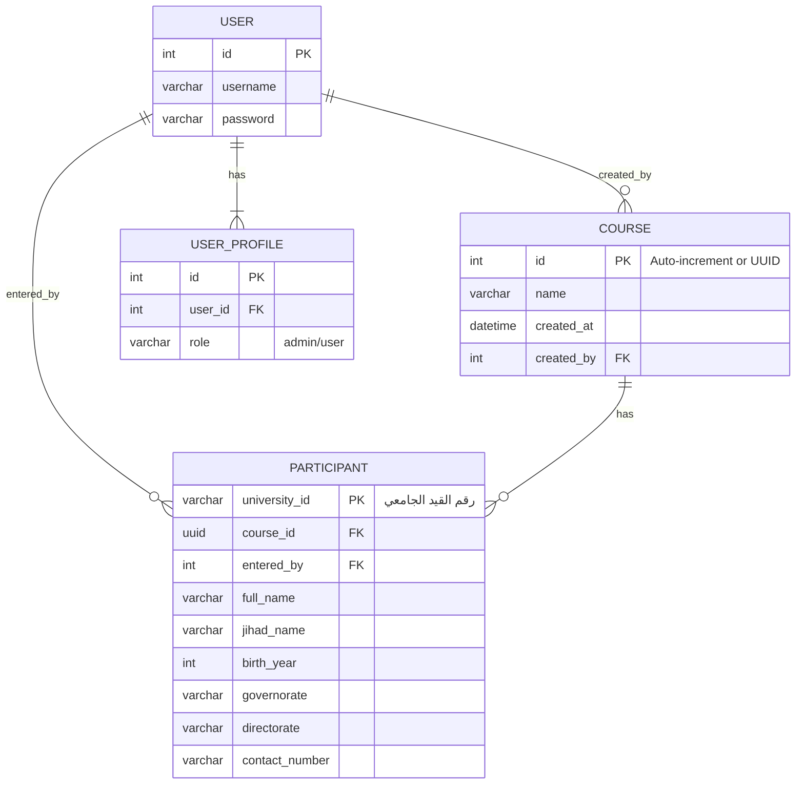

```mermaid
erDiagram
    USER ||--o{ COURSE : created_by
    USER ||--o{ PARTICIPANT : entered_by
    USER ||--|{ USER_PROFILE : has
    COURSE ||--o{ PARTICIPANT : has

    USER {
        int id PK
        varchar username
        varchar password
    }

    USER_PROFILE {
        int id PK
        int user_id FK
        varchar role "admin/user"
    }

    COURSE {
        int id PK "Auto-increment or UUID"
        varchar name
        datetime created_at
        int created_by FK
    }

    PARTICIPANT {
        varchar university_id PK "رقم القيد الجامعي"
        uuid course_id FK
        int entered_by FK
        varchar full_name
        varchar jihad_name
        int birth_year
        varchar governorate
        varchar directorate
        varchar contact_number
    }
```
